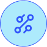
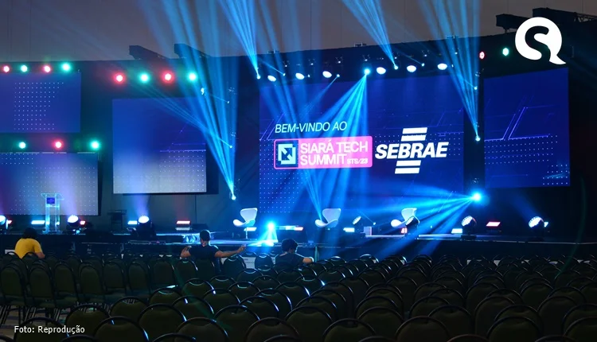
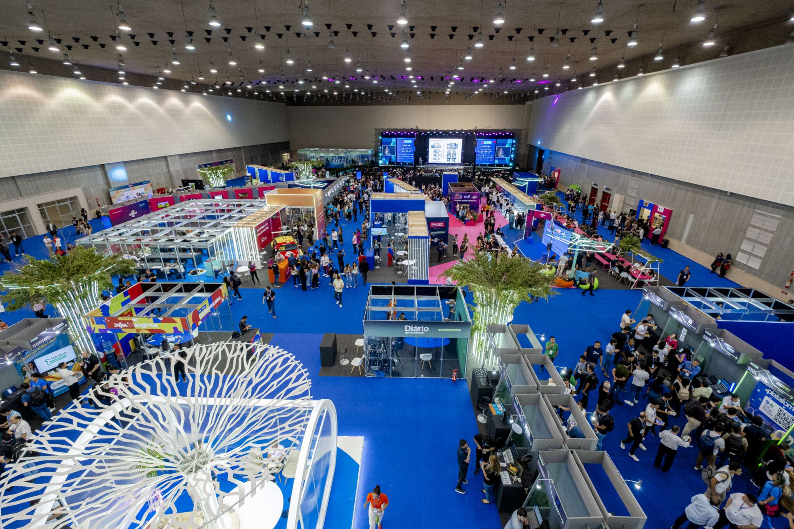
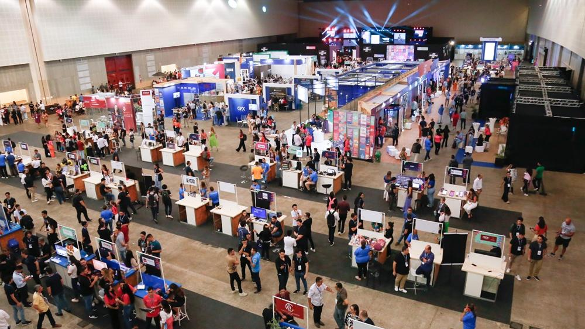
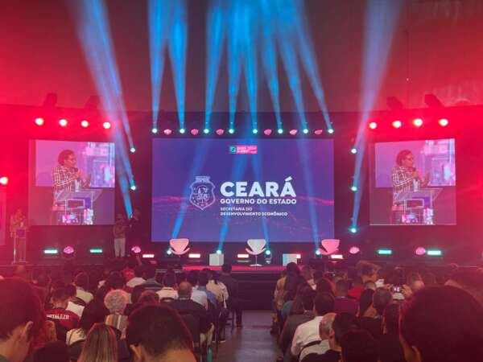
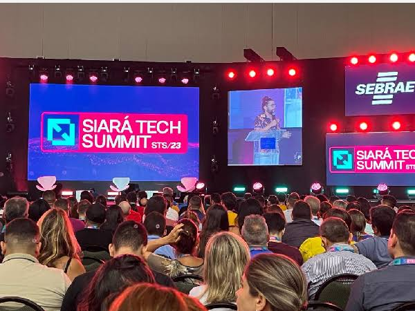
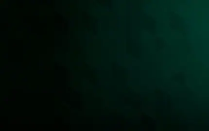

# Feira do Empreendedor + Siará Tech Summit 2025

Landing page institucional do maior evento de empreendedorismo, tecnologia e inovação do Ceará — desenvolvida com **React 19**, **TypeScript**, **Tailwind CSS** e **Framer Motion**.

<p align="center">
  
  &nbsp;&nbsp;
  
</p>

<p align="center">
  
</p>

<p align="center">
  <strong>8 a 10 de outubro de 2025</strong> · Centro de Eventos do Ceará
</p>

---

## Sobre o projeto

Site one-page responsivo para divulgação da **Feira do Empreendedor** e do **Siará Tech Summit (STS)**. O layout apresenta contagem regressiva, métricas da edição anterior, inscrições, palestrantes, galeria de momentos, newsletter e área de patrocínio — com identidade visual em laranja, rosa e azul, ondas SVG animadas e transições suaves entre seções.

### Destaques

- Hero em tela cheia com vídeo do YouTube e contagem regressiva
- Seção de métricas com animação count-up
- Cards de inscrição para Feira do Empreendedor e Siará Tech Summit
- Carrossel de momentos marcantes com autoplay e controles acessíveis
- Grid de palestrantes com hover e animações de entrada
- Formulário de newsletter e ondas de transição entre seções
- Layout mobile-first com breakpoints customizados

---

## Prévia das seções

### Momentos marcantes

Carrossel interativo com fotos da última edição, barra de progresso, miniaturas e CTA de participação.

<p align="center">
  
  
</p>

<p align="center">
  
  
</p>

### Palestrantes

Grid responsivo com cards em destaque para os nomes confirmados da programação.

<p align="center">
  
</p>

### Patrocínio

Seção dedicada a apoiadores e parceiros do evento.

<p align="center">
  
</p>

---

## Paleta de cores

| Cor | Hex | Uso |
|-----|-----|-----|
| Laranja | `#FF8F5A` | Hero, métricas, CTAs |
| Rosa | `#EF3970` | Seções institucionais, galeria |
| Azul | `#3256FB` | Siará Tech Summit, botões |
| Verde | `#75F4C3` | Destaques e acentos |

---

## Tecnologias

| Tecnologia | Versão | Função |
|------------|--------|--------|
| [React](https://react.dev/) | 19 | Interface e componentes |
| [Vite](https://vitejs.dev/) | 7 | Build e dev server |
| [TypeScript](https://www.typescriptlang.org/) | 5.8 | Tipagem estática |
| [Tailwind CSS](https://tailwindcss.com/) | 3.4 | Estilização utilitária |
| [Framer Motion](https://www.framer.com/motion/) | 12 | Animações e transições |
| [Lucide React](https://lucide.dev/) | — | Ícones do carrossel |
| [React Icons](https://react-icons.github.io/react-icons/) | — | Redes sociais no footer |

---

## Estrutura do projeto

```
feira_empreendedor-/
├── public/
│   └── fonts/              # Fonte Nexa
├── src/
│   ├── assets/             # Imagens e logos
│   │   ├── image.png
│   │   ├── images.png
│   │   ├── logo_empreendedor.png
│   │   ├── Logo_Summit.png
│   │   ├── momento1.png … momento4.png
│   │   └── patrocinio.png
│   ├── components/
│   │   ├── Contagem.tsx        # Hero + vídeo + countdown
│   │   ├── Header.tsx          # Navegação fixa
│   │   ├── MetricaSection.tsx  # Números do evento
│   │   ├── Secao.tsx           # Manifesto institucional
│   │   ├── Evento.tsx          # Cards de inscrição
│   │   ├── Galeria.tsx         # Palestrantes 2025
│   │   ├── MomentosMarcantes.tsx # Carrossel da galeria
│   │   ├── New.tsx             # Newsletter
│   │   ├── Patrocinio.tsx      # Patrocinadores
│   │   ├── Footer.tsx          # Rodapé
│   │   └── OndaAnimada.tsx     # Ondas SVG entre seções
│   ├── App.tsx
│   ├── main.tsx
│   ├── index.css
│   └── output.css              # CSS compilado do Tailwind
├── tailwind.config.js
├── vite.config.ts
└── package.json
```

---

## Requisitos

- **Node.js** 18 ou superior
- **npm**, yarn ou pnpm

---

## Instalação e execução

```bash
# Clone o repositório
git clone https://github.com/seu-usuario/feira_empreendedor-.git
cd feira_empreendedor-

# Instale as dependências
npm install

# Inicie o servidor de desenvolvimento
npm run dev
```

Acesse [http://localhost:5173](http://localhost:5173) no navegador.

### Compilar CSS do Tailwind

Após alterar classes Tailwind nos componentes:

```bash
npx tailwindcss -i ./src/input.css -o ./src/output.css
```

### Build de produção

```bash
npm run build
npm run preview
```

Os arquivos finais ficam na pasta `dist/`.

### Lint

```bash
npm run lint
```

---

## Seções da página

| Seção | Componente | Descrição |
|-------|------------|-----------|
| Header | `Header.tsx` | Menu e botão "Quero participar" |
| Home | `Contagem.tsx` | Vídeo, título e contagem regressiva |
| Métricas | `MetricaSection.tsx` | Inscritos, palestras, expositores, startups |
| Institucional | `Secao.tsx` | Texto + vídeo "Assistir" |
| Inscrições | `Evento.tsx` | Feira do Empreendedor e STS |
| Palestrantes | `Galeria.tsx` | Grid de speakers |
| Galeria | `MomentosMarcantes.tsx` | Carrossel de fotos |
| Newsletter | `New.tsx` | Captura de e-mail |
| Patrocínio | `Patrocinio.tsx` | Apoiadores do evento |
| Rodapé | `Footer.tsx` | Logos, direitos e redes sociais |

---

## Scripts disponíveis

| Comando | Descrição |
|---------|-----------|
| `npm run dev` | Servidor de desenvolvimento |
| `npm run build` | Build de produção |
| `npm run preview` | Preview da build |
| `npm run lint` | Verificação ESLint |

---

## Licença e créditos

Projeto desenvolvido para o **Sebrae Ceará**.

<p align="center">
  
</p>

<p align="center">
  Feito com dedicação por <strong>Lay Matos</strong>
</p>
