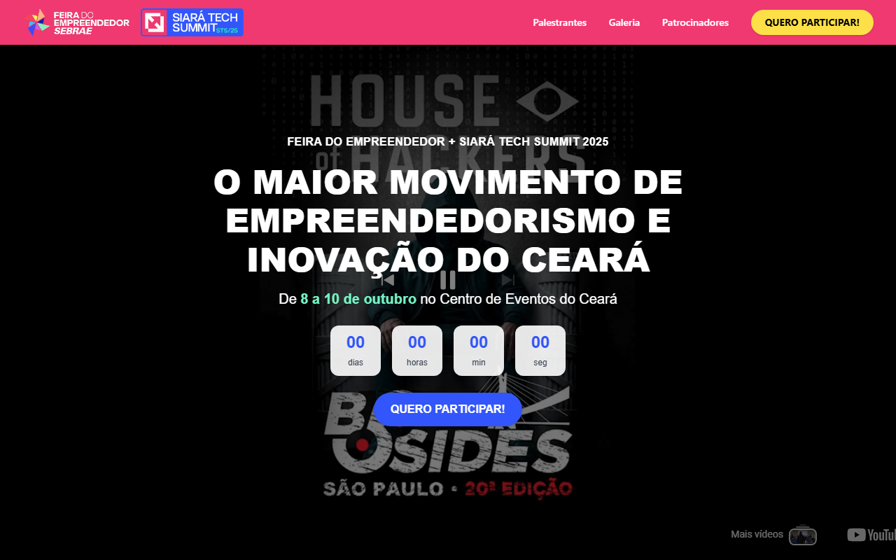
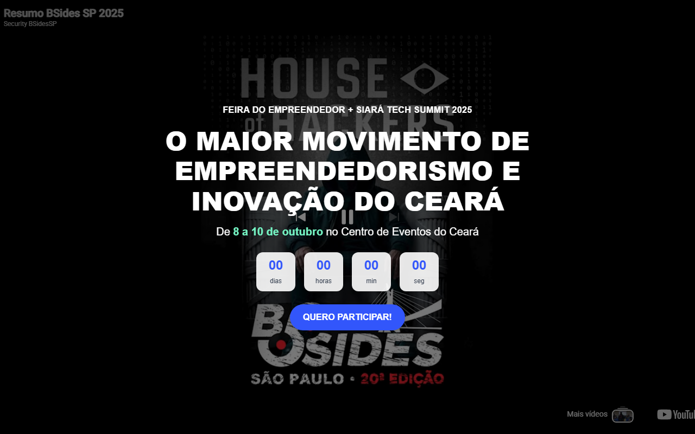
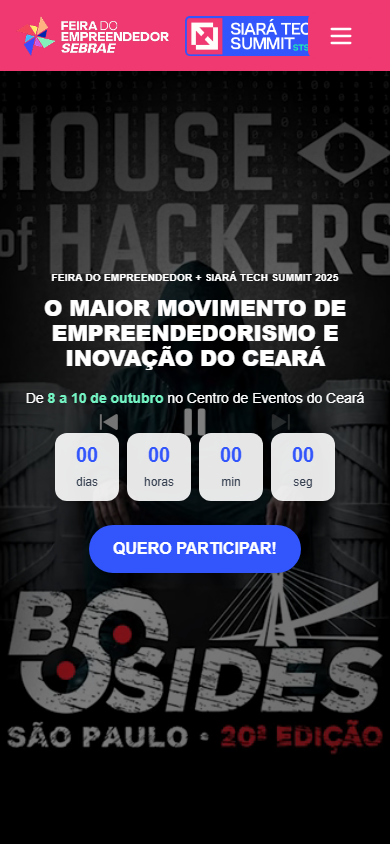
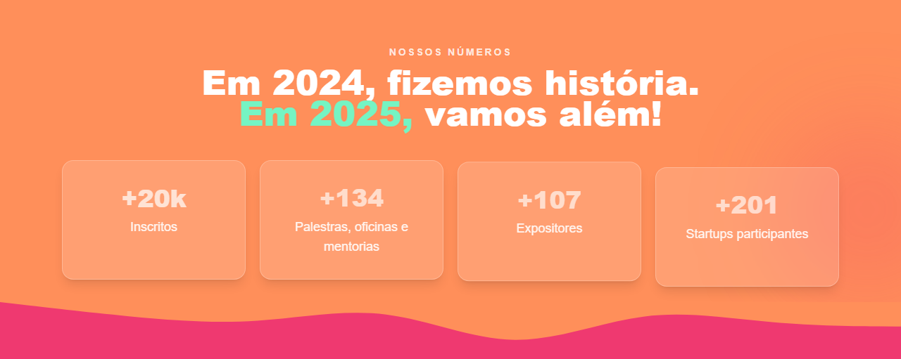
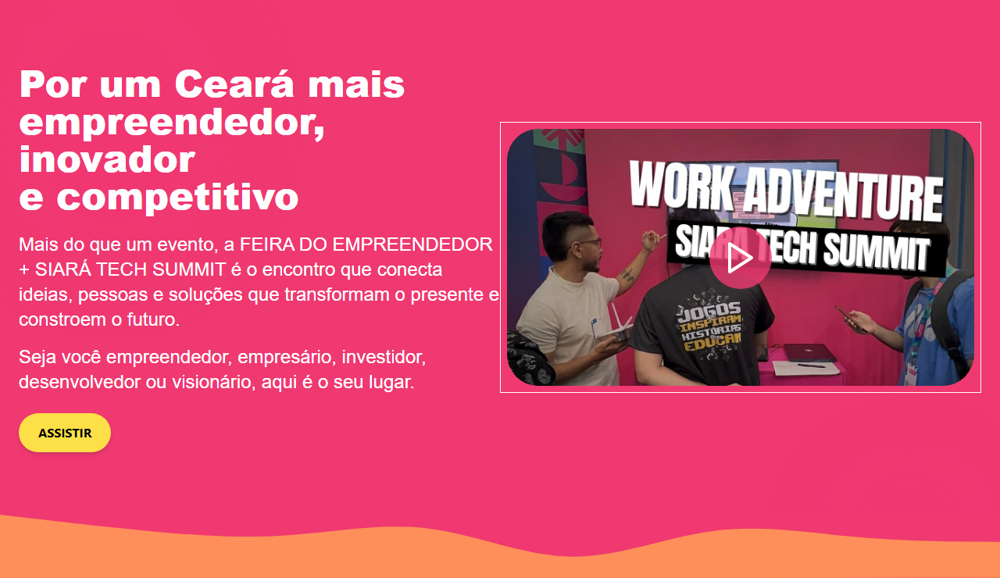
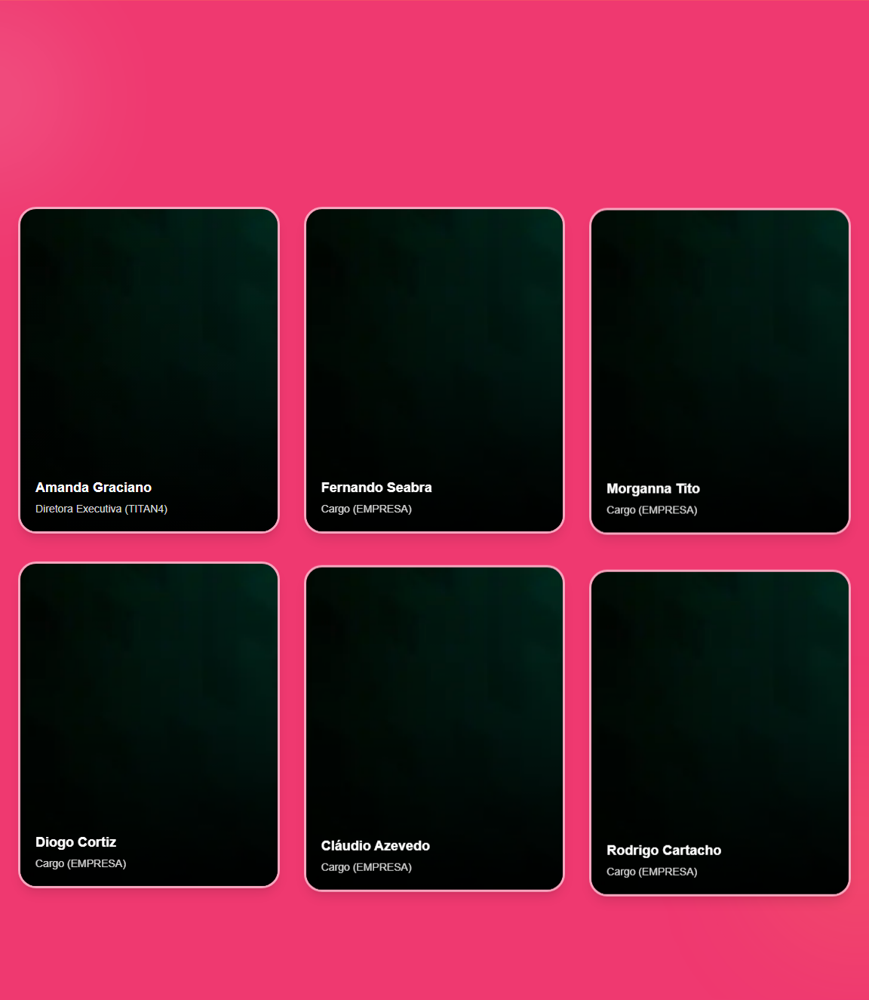
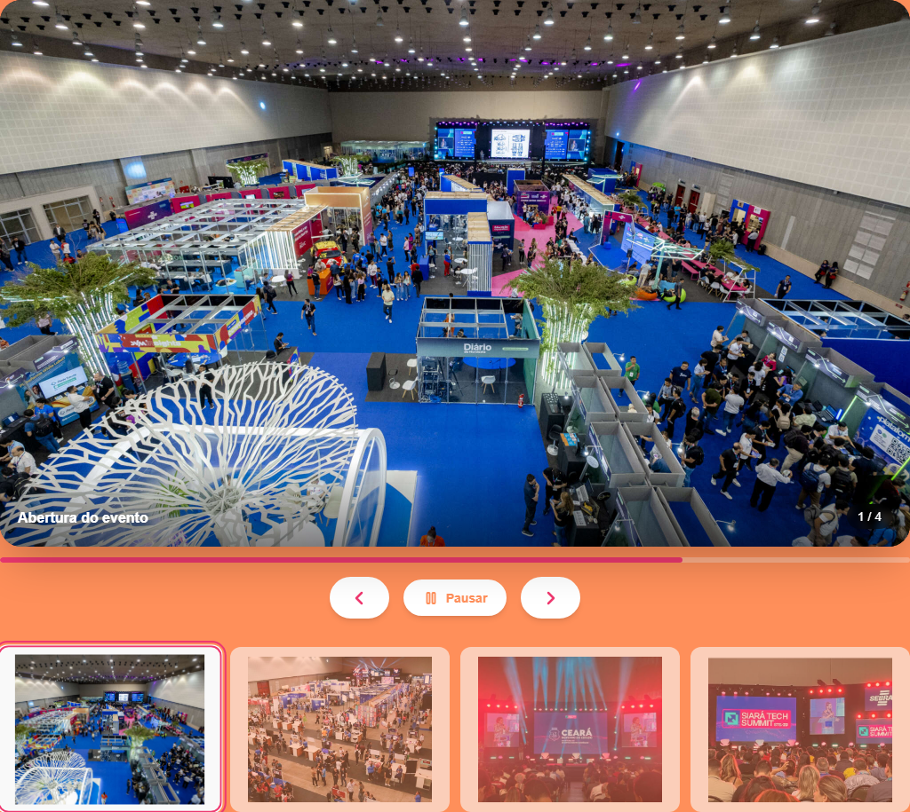
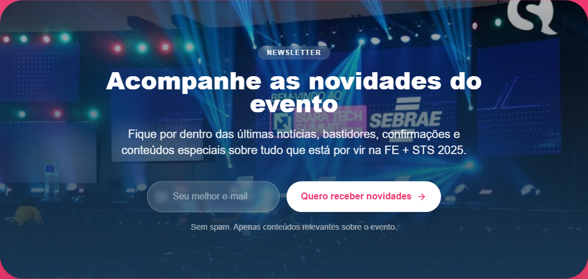

# Feira do Empreendedor + Siará Tech Summit 2025

Landing page institucional do maior evento de empreendedorismo, tecnologia e inovação do Ceará — desenvolvida com **React 19**, **TypeScript**, **Tailwind CSS** e **Framer Motion**.

<p align="center">
  
</p>

<p align="center">
  <strong>8 a 10 de outubro de 2025</strong> · Centro de Eventos do Ceará
</p>

---

## Sobre o projeto

Site one-page responsivo para divulgação da **Feira do Empreendedor** e do **Siará Tech Summit (STS)**. O layout apresenta contagem regressiva, métricas da edição anterior, inscrições, palestrantes, galeria de momentos, newsletter e área de patrocínio — com identidade visual em laranja, rosa e azul, ondas SVG entre seções e animações suaves.

### Destaques

- Hero em tela cheia com vídeo do YouTube e contagem regressiva
- Seção de métricas com animação count-up
- Cards de inscrição para Feira do Empreendedor e Siará Tech Summit
- Carrossel de momentos marcantes com autoplay e controles acessíveis
- Grid de palestrantes com hover e animações de entrada
- Formulário de newsletter e transições onduladas entre seções
- Layout mobile-first e totalmente responsivo

---

## Prévia do site

<details>
<summary><strong>Visão geral da página (clique para expandir)</strong></summary>
<br />
<p align="center">
  
</p>
</details>

### Hero — Desktop

<p align="center">
  
</p>

### Hero — Mobile

<p align="center">
  
</p>

### Métricas do evento

<p align="center">
  
</p>

### Seção institucional

<p align="center">
  
</p>

### Inscrições

<p align="center">
  
</p>

### Palestrantes 2025

<p align="center">
  
</p>

### Galeria — Momentos marcantes

<p align="center">
  
</p>

### Newsletter

<p align="center">
  
</p>

### Patrocínio

<p align="center">
  
</p>

---

## Paleta de cores

| Cor | Hex | Uso |
|-----|-----|-----|
| Laranja | `#FF8F5A` | Hero, métricas, CTAs |
| Rosa | `#EF3970` | Seções institucionais, galeria |
| Azul | `#3256FB` | Siará Tech Summit, botões |
| Verde | `#75F4C3` | Destaques e acentos |

---

## Tecnologias

| Tecnologia | Versão | Função |
|------------|--------|--------|
| [React](https://react.dev/) | 19 | Interface e componentes |
| [Vite](https://vitejs.dev/) | 7 | Build e dev server |
| [TypeScript](https://www.typescriptlang.org/) | 5.8 | Tipagem estática |
| [Tailwind CSS](https://tailwindcss.com/) | 3.4 | Estilização utilitária |
| [Framer Motion](https://www.framer.com/motion/) | 12 | Animações e transições |
| [Lucide React](https://lucide.dev/) | — | Ícones do carrossel |
| [React Icons](https://react-icons.github.io/react-icons/) | — | Redes sociais no footer |

---

## Estrutura do projeto

```
feira_empreendedor-/
├── docs/
│   └── screenshots/        # Prints do site para o README
├── public/
│   └── fonts/              # Fonte Nexa
├── scripts/
│   └── capture-screenshots.mjs
├── src/
│   ├── assets/             # Imagens e logos
│   ├── components/
│   │   ├── Contagem.tsx        # Hero + vídeo + countdown
│   │   ├── Header.tsx          # Navegação fixa
│   │   ├── MetricaSection.tsx  # Números do evento
│   │   ├── Secao.tsx           # Manifesto institucional
│   │   ├── Evento.tsx          # Cards de inscrição
│   │   ├── Galeria.tsx         # Palestrantes 2025
│   │   ├── MomentosMarcantes.tsx # Carrossel da galeria
│   │   ├── New.tsx             # Newsletter
│   │   ├── Patrocinio.tsx      # Patrocinadores
│   │   ├── Footer.tsx          # Rodapé
│   │   └── OndaAnimada.tsx     # Ondas SVG entre seções
│   ├── App.tsx
│   └── main.tsx
├── tailwind.config.js
└── package.json
```

---

## Requisitos

- **Node.js** 18 ou superior
- **npm**, yarn ou pnpm

---

## Instalação e execução

```bash
git clone https://github.com/seu-usuario/feira_empreendedor-.git
cd feira_empreendedor-
npm install
npm run dev
```

Acesse [http://localhost:5173](http://localhost:5173) no navegador.

### Compilar CSS do Tailwind

```bash
npx tailwindcss -i ./src/input.css -o ./src/output.css
```

### Build de produção

```bash
npm run build
npm run preview
```

### Gerar novos prints do site

Com o servidor rodando (`npm run dev`):

```bash
npx playwright install chromium
node scripts/capture-screenshots.mjs
```

As imagens são salvas em `docs/screenshots/` com largura fixa de **1280px** para exibição correta no GitHub.

### Lint

```bash
npm run lint
```

---

## Seções da página

| Seção | Componente | Descrição |
|-------|------------|-----------|
| Header | `Header.tsx` | Menu e botão "Quero participar" |
| Home | `Contagem.tsx` | Vídeo, título e contagem regressiva |
| Métricas | `MetricaSection.tsx` | Inscritos, palestras, expositores, startups |
| Institucional | `Secao.tsx` | Texto + vídeo "Assistir" |
| Inscrições | `Evento.tsx` | Feira do Empreendedor e STS |
| Palestrantes | `Galeria.tsx` | Grid de speakers |
| Galeria | `MomentosMarcantes.tsx` | Carrossel de fotos |
| Newsletter | `New.tsx` | Captura de e-mail |
| Patrocínio | `Patrocinio.tsx` | Apoiadores do evento |
| Rodapé | `Footer.tsx` | Logos, direitos e redes sociais |

---

## Scripts disponíveis

| Comando | Descrição |
|---------|-----------|
| `npm run dev` | Servidor de desenvolvimento |
| `npm run build` | Build de produção |
| `npm run preview` | Preview da build |
| `npm run lint` | Verificação ESLint |

---

<p align="center">
  Feito com dedicação por <strong>Lay Matos</strong>
</p>
